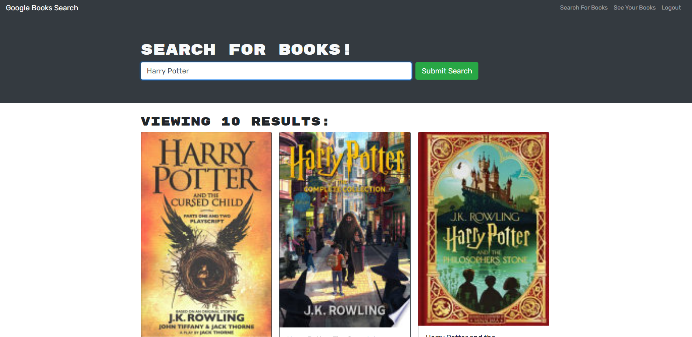
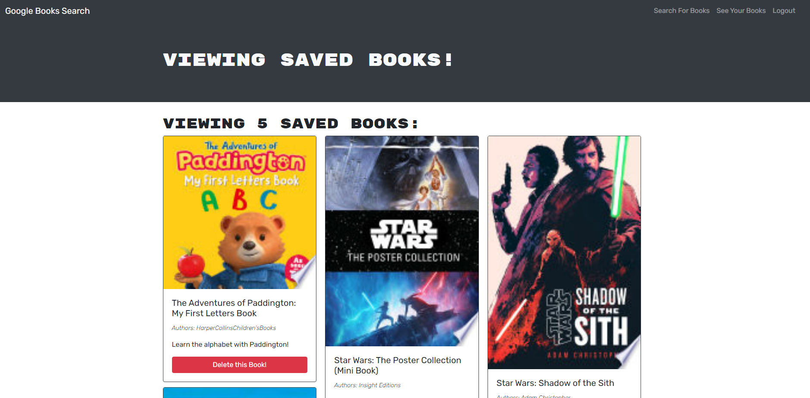

# Book search engine [](https://opensource.org/licenses/MIT)

## Description
A book search engine. Uses google books api to display search results. Utilizes graphql and mongoDB

## Table of Contents
- [Installation](#installation)

- [Usage](#usage)

- [License](#license)

Searching for books


Your saved books


## Installation
To install the necessary dependencies, run the following command:

```

npm i

```

## Usage
- ```npm i``` or ```npm run install``` to install the packages for both the server and client

- ```npm run develop``` to run both the server and client. Server is on http://localhost:3001 and client is on http://localhost:3000

- ```npm start``` to start the server

- ```npm run build``` to build the client side

## License
This project is licensed under the [MIT](https://opensource.org/licenses/MIT) license